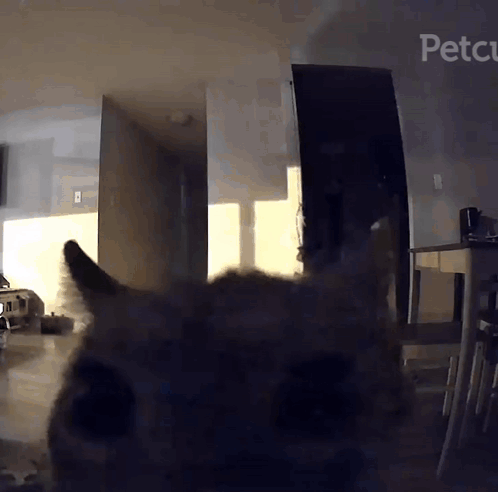

<!-- <!DOCTYPE html> -->
<html>
<head>
  <link rel="icon" type="image/png" href="assets/photos/Favicon.png">
  <meta name="viewport" content="width=device-width, initial-scale=1">
 <title>OSSIFER</title>
  
</head>
<body>
  

  

  
 
    <iframe src="https://www.submithub.com/link/ossifer?new_window=true" scrolling="no" height="800px"></iframe>
  <!--   -->
  

  
Defined by dark soundscapes and intricate rhythms, OSSIFER stands at the forefront of Austin’s burgeoning post-metal landscape, 
    carving out a unique niche that blends aggressive sounds with introspective lyrics and shoegaze guitar stylings. 
    Their compositions are a sonic journey through ethereal realms, offering listeners an escape into a world where heaviness meets haunting beauty.

  
The members of OSSIFER first met in 2016 in the small university town of San Marcos, TX, home of renowned post-rock pioneers This Will Destroy You. 
    Growing from the ashes of a defunct project called The Return South, a shape-shifting rock band that frequently changed names came to life. 
    The band consisted of guitarist / composer Caleb, bassist Ximena and drummer Alex, the permanent lineup that would eventually become OSSIFER in 2022.

  
The trio weathered numerous creative shifts and sporadic hiatuses, slowly uncovering their sonic signature against the backdrop of a turbulent political era
    and a global pandemic. Their compositions grew darker, richer and more complex as they settled comfortably into the new wave of emerging doomgaze, atmospheric sludge and 
    post-metal artists including bands like Iress, Fvnerals and BIG|BRAVE.

  

</body>
</html>
